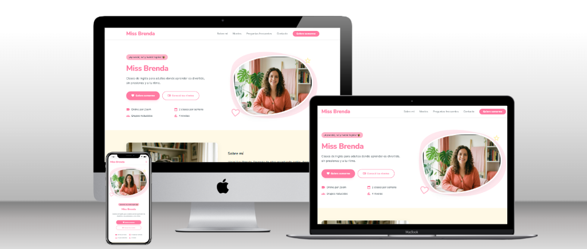

# Miss Brenda - Landing Page ✨

Una landing page moderna, responsiva y altamente atractiva diseñada para promocionar las clases de inglés para adultos de **Miss Brenda**. Este proyecto está optimizado para ofrecer una excelente experiencia de usuario con una estética premium, animaciones fluidas y tiempos de carga ultra rápidos.

👉 **Sitio web en vivo:** [missbrenda.netlify.app](https://missbrenda.netlify.app/)

---

## 📸 Presentación y Mockup Responsivo

Así luce la landing page en diferentes dispositivos:

---

## ✨ Características Clave

- 📱 **Diseño 100% Responsivo:** Completamente optimizado para visualizarse correctamente en celulares, tablets y pantallas de escritorio.
- ⚡ **Máximo Rendimiento:** Construido únicamente con HTML5 y CSS3 puro. Sin scripts innecesarios, lo que garantiza una velocidad de carga instantánea y excelente puntuación en SEO.
- 🎨 **Estética Premium y Vibrante:** Paleta de colores cálida y moderna (tonos pasteles, rosas y amarillos), sombras suaves y formas orgánicas únicas.
- 🌀 **Micro-animaciones Suaves:** Efectos de flotación y rebote al pasar el cursor (hover) para incentivar la interacción del usuario.
- 🛠️ **Desplazamiento Suave (Smooth Scroll):** Navegación fluida y nativa a través de los enlaces del menú hacia las secciones correspondientes de la página sin necesidad de JavaScript.
- 📧 **Llamados a la Acción (CTA) Integrados:** Botones configurados de forma nativa (`mailto:`) para que los alumnos interesados puedan enviar un correo de inscripción directamente al hacer clic.

---

## 🛠️ Tecnologías Utilizadas

- **Estructura:** HTML5 Semántico
- **Estilos:** CSS3 (Variables nativas, Flexbox, CSS Grid y Media Queries)
- **Tipografías:** [Nunito Sans](https://fonts.google.com/specimen/Nunito+Sans) & [Inter](https://fonts.google.com/specimen/Inter) vía Google Fonts
- **Iconos:** [Google Material Symbols Outlined](https://fonts.google.com/icons)

## 👩‍💻 Autoría y Créditos

Este proyecto fue desarrollado y maquetado con mucho amor y detalle por:
* **Joana R.** - *Desarrolladora Front-End* (© 2025)

> **Aclaración:** Esta página de práctica está inspirada en el curso de inglés que realizo actualmente con Miss Brenda.
> **PD:** Proyecto creado originalmente en 2025.
